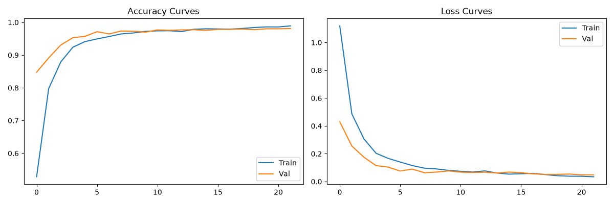
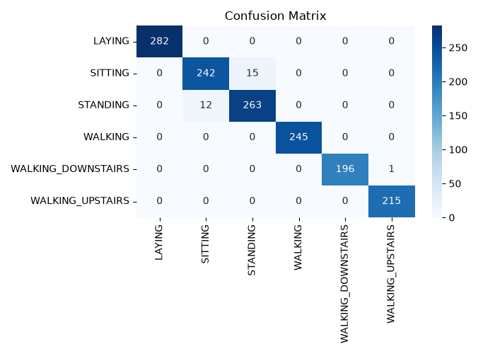

# Human Activity Recognition Using Deep Neural Networks


A modular, production-ready Deep Learning framework that accurately classifies human physical activities using smartphone sensor domain streams.

---

## 📌 Performance Summary
* **Test Classification Accuracy:** **~97.6%**
* **Target Activities (6):** Laying, Sitting, Standing, Walking, Walking Upstairs, Walking Downstairs
* **Feature Scope:** 561 pre-engineered sensor time-series domain variables

---

## 📊 Evaluation Artifacts

| Accuracy & Loss Trends | Confusion Matrix |
| :---: | :---: |
|  |  |

---

## 📂 Repository Layout

```text
├── assets/             # Exported performance charts
├── data/               # Sensor dataset CSV files
├── src/
│   ├── preprocess.py   # Standard scaling & label encoding pipeline
│   ├── model.py        # Multi-Layer Perceptron model definition
│   └── train.py        # Execution script & metric visualizer
├── requirements.txt    # Library dependencies
└── README.md           # Documentation
```

## Run locally

Run commands from the repository directory (the one containing
`requirements.txt`), not its parent:

```powershell
cd C:\HAR\Human-Activity-Recognition-Using-Neural-Networks
python -m pip install -r requirements.txt
python src\train.py
python src\baselines.py
python src\export_tflite.py
```

The loader accepts either `data/train.csv` as a file or, when extraction
created a same-named folder, `data/train.csv/train.csv`. If there is no
separate `data/test.csv`, it makes a reproducible stratified 80/20 split.
Training writes `saved_har_model.h5`; the TFLite step uses it to create
`har_model_quantized.tflite`.
